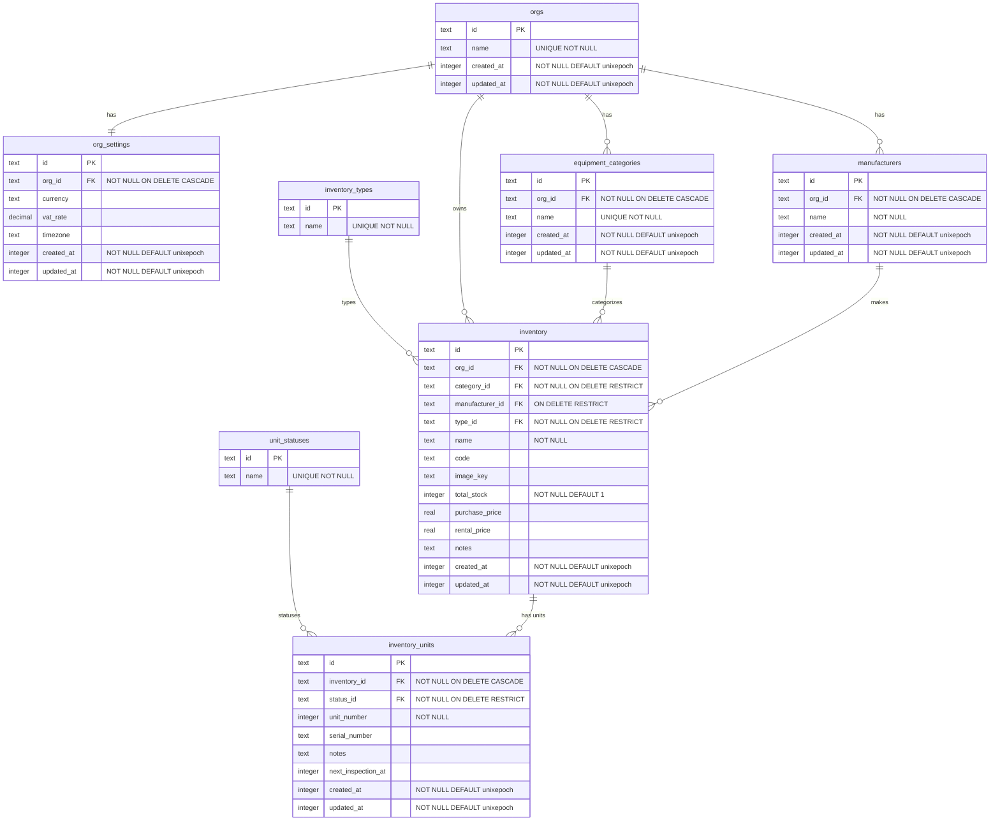

# Database

```mermaid
erDiagram
  orgs {
    text id PK
    text name "UNIQUE NOT NULL"
    integer created_at "NOT NULL DEFAULT unixepoch"
    integer updated_at "NOT NULL DEFAULT unixepoch"
  }

  org_settings {
    text id PK
    text org_id FK "NOT NULL ON DELETE CASCADE"
    text currency
    decimal vat_rate
    text timezone
    integer created_at "NOT NULL DEFAULT unixepoch"
    integer updated_at "NOT NULL DEFAULT unixepoch"
  }

  equipment_categories {
    text id PK
    text org_id FK "NOT NULL ON DELETE CASCADE"
    text name "UNIQUE NOT NULL"
    integer created_at "NOT NULL DEFAULT unixepoch"
    integer updated_at "NOT NULL DEFAULT unixepoch"
  }

  manufacturers {
    text id PK
    text org_id FK "NOT NULL ON DELETE CASCADE"
    text name "NOT NULL"
    integer created_at "NOT NULL DEFAULT unixepoch"
    integer updated_at "NOT NULL DEFAULT unixepoch"
  }
  %% name must be unique per org: UNIQUE(org_id, name)

  inventory_types {
    text id PK
    text name "UNIQUE NOT NULL"
  }
  %% seeded with bulk and serialized; extend by inserting new rows

  inventory {
    text id PK
    text org_id FK "NOT NULL ON DELETE CASCADE"
    text category_id FK "NOT NULL ON DELETE RESTRICT"
    text manufacturer_id FK "ON DELETE RESTRICT"
    text type_id FK "NOT NULL ON DELETE RESTRICT"
    text name "NOT NULL"
    text code
    text image_key
    integer total_stock "NOT NULL DEFAULT 1"
    real purchase_price
    real rental_price
    text notes
    integer created_at "NOT NULL DEFAULT unixepoch"
    integer updated_at "NOT NULL DEFAULT unixepoch"
  }
  %% code is a user-defined identifier (e.g. an internal asset code like 4993); optional and not enforced for uniqueness

  unit_statuses {
    text id PK
    text name "UNIQUE NOT NULL"
  }
  %% seeded with available, in_service, retired

  inventory_units {
    text id PK
    text inventory_id FK "NOT NULL ON DELETE CASCADE"
    text status_id FK "NOT NULL ON DELETE RESTRICT"
    integer unit_number "NOT NULL"
    text serial_number
    text notes
    integer next_inspection_at
    integer created_at "NOT NULL DEFAULT unixepoch"
    integer updated_at "NOT NULL DEFAULT unixepoch"
  }
  %% unit_number must be unique per inventory item: UNIQUE(inventory_id, unit_number)
  %% unit_number is auto-assigned by the application (next available integer per inventory item); serial_number is optional

  inventory_types ||--o{ inventory : "types"
  unit_statuses ||--o{ inventory_units : "statuses"
  orgs ||--|| org_settings : "has"
  orgs ||--o{ equipment_categories : "has"
  orgs ||--o{ manufacturers : "has"
  orgs ||--o{ inventory : "owns"
  equipment_categories ||--o{ inventory : "categorizes"
  manufacturers ||--o{ inventory : "makes"
  inventory ||--o{ inventory_units : "has units"
```
