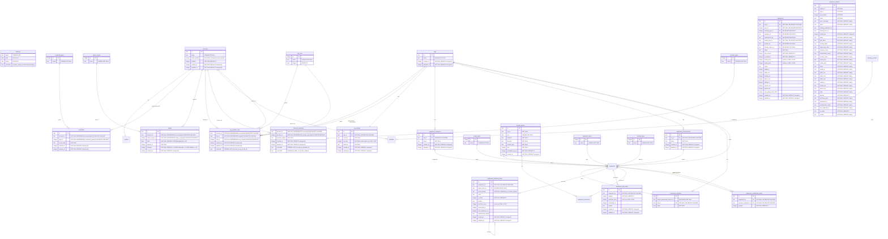

# Database (Proposed)

```mermaid
erDiagram
  sessions {
    text token "PRIMARY KEY"
    blob data "NOT NULL"
    real expiry "NOT NULL"
    text constraint "sessions_expiry_idx ON sessions(expiry)"
  }

  accounts {
    text id PK
    text email "UNIQUE NOT NULL"
    integer email_verified "NULLABLE; unixepoch() when verified"
    integer enabled "NOT NULL DEFAULT 1"
    
    integer created_at "NOT NULL DEFAULT unixepoch()"
    integer updated_at "NOT NULL DEFAULT unixepoch()"
  }
  %% PII: email

  credential_types {
    integer id PK
    text name "UNIQUE NOT NULL"
  }
  %% password, totp, webauthn

  credentials {
    text id PK
    text account_id "NOT NULL REFERENCES accounts(id) ON DELETE CASCADE"
    integer type_id "NOT NULL REFERENCES credential_types(id) ON DELETE RESTRICT"
    text secret_data "NOT NULL"

    integer created_at "NOT NULL DEFAULT unixepoch()"
    integer updated_at "NOT NULL DEFAULT unixepoch()"
  }
  %% secret_data: argon2id hash for password. one password per account enforced by partial unique index in migration

  token_scopes {
    integer id PK
    text name "UNIQUE NOT NULL"
  }
  %% password-reset, email-verification

  tokens {
    text id PK
    text account_id "NOT NULL REFERENCES accounts(id) ON DELETE CASCADE"
    integer token_scope_id "NOT NULL REFERENCES token_scopes(id) ON DELETE RESTRICT"
    blob hash "NOT NULL UNIQUE; CHECK(length(hash) = 32)"
    integer expires_at "NOT NULL"
    integer attempts "NOT NULL DEFAULT 0; CHECK (attempts >= 0 AND attempts <= 5)"
    
    integer created_at "NOT NULL DEFAULT unixepoch()"
  }

  orgs {
    text id PK
    text name "UNIQUE NOT NULL"
    integer created_at "NOT NULL DEFAULT unixepoch"
    integer updated_at "NOT NULL DEFAULT unixepoch"
  }

  org_settings {
    text id PK
    text org_id FK "NOT NULL ON DELETE CASCADE"
    text currency "NOT NULL"
    integer vat_rate "NOT NULL basis points e.g. 1900 = 19%"
    text timezone "NOT NULL"
    integer created_at "NOT NULL DEFAULT unixepoch"
    integer updated_at "NOT NULL DEFAULT unixepoch"
  }

  org_roles {
    integer id PK
    text name "UNIQUE NOT NULL"
    rank integer "DEFAULT 0"
  }
  %% admin, editor, viewer

  org_member_roles {
    text account_id "NOT NULL REFERENCES accounts(id) ON DELETE CASCADE"
    text org_id "NOT NULL REFERENCES orgs(id) ON DELETE CASCADE"
    integer role_id "NOT NULL REFERENCES org_roles(id) ON DELETE RESTRICT"
    integer created_at "NOT NULL DEFAULT unixepoch()"
    integer updated_at "NOT NULL DEFAULT unixepoch()"
    text constraint "PRIMARY KEY (account_id, org_id, role_id)"
  }

  accounts ||--|| profiles : "has"
  accounts ||--o{ credentials : "authenticates with"
  accounts ||--o{ tokens : "requests"
  accounts ||--o{ org_member_roles : "belongs to"
  accounts ||--o{ federated_identities : "signs in via"

  credential_types ||--o{ credentials : "types"
  token_scopes ||--o{ tokens : "scopes"
  provider_types ||--o{ federated_identities : "provided by"

  orgs ||--o{ org_member_roles : "has members"
  org_roles ||--o{ org_member_roles : "grants"

  equipment_categories {
    text id PK
    text org_id FK "ON DELETE CASCADE"
    text name "NOT NULL"
    integer created_at "NOT NULL DEFAULT unixepoch"
    integer updated_at "NOT NULL DEFAULT unixepoch"
  }
  %% org_id=NULL means global preseeded category visible to all orgs
  %% org_id set means org-specific custom category
  %% query: WHERE org_id = ? OR org_id IS NULL
  %% UNIQUE(org_id, name) allows same name in different orgs but not within the same org

  equipment_manufacturers {
    text id PK
    text org_id FK "NOT NULL ON DELETE CASCADE"
    text name "NOT NULL"
    integer created_at "NOT NULL DEFAULT unixepoch"
    integer updated_at "NOT NULL DEFAULT unixepoch"
  }
  %% name must be unique per org: UNIQUE(org_id, name)

  usage_types {
    integer id PK
    text name "UNIQUE NOT NULL"
  }
  %% seeded with rental and sale; extend by inserting new rows

  storage_objects {
    text id PK
    text org_id "NOT NULL"
    text key "UNIQUE NOT NULL"
    text backend "NOT NULL"
    text filename "NOT NULL"
    text content_type "NOT NULL"
    integer size "NOT NULL"
    integer encryption_key_id "NOT NULL DEFAULT 0"
    integer created_at "NOT NULL DEFAULT unixepoch"
  }

  warehouse_locations {
    text id PK
    text parent_warehouse_location_id "ON DELETE SET NULL"
    text org_id FK "NOT NULL ON DELETE CASCADE"
    text name "NOT NULL"
  }

  equipment_types {
    integer id PK
    text name "UNIQUE NOT NULL"
  }
  %% seeded with physical, virtual; extend by inserting new rows

  tracking_types {
    integer id PK
    text name "UNIQUE NOT NULL"
  }
  %% seeded with bulk, serialized; extend by inserting new rows
  %% NULL on equipment when type=virtual

  equipments {
    text id PK
    text org_id FK "NOT NULL ON DELETE CASCADE"
    integer type_id FK "NOT NULL ON DELETE RESTRICT"
    integer tracking_type_id FK "ON DELETE RESTRICT"
    text category_id FK "ON DELETE RESTRICT"
    text manufacturer_id FK "ON DELETE RESTRICT"
    text usage_type_id FK "NOT NULL ON DELETE RESTRICT"
    text location_id FK "ON DELETE SET NULL"
    text storage_object_id FK "ON DELETE SET NULL"
    text name "NOT NULL"
    integer has_content "NOT NULL DEFAULT 0"
    integer is_archived "NOT NULL DEFAULT 0"
    integer rental_price "cents e.g. 1999 = 19.99"
    integer resale_price "cents e.g. 1999 = 19.99"
    text notes
    integer weight_g
    integer width_mm
    integer height_mm
    integer depth_mm
    integer voltage_v
    integer current_ma
    integer power_mw
    integer wire_gauge_mm2_x100
    integer created_at "NOT NULL DEFAULT unixepoch"
    integer updated_at "NOT NULL DEFAULT unixepoch"
  }

  equipment_serialized_items {
    text id PK
    text equipment_id FK "NOT NULL ON DELETE CASCADE"
    text parent_item_id FK "ON DELETE SET NULL"
    text serial_number "NOT NULL UNIQUE(org_id,serial_number)"
    text code
    integer is_active "NOT NULL DEFAULT 1"
    text remark
    integer purchase_price "cents e.g. 1999 = 19.99"
    integer purchased_at
    integer next_inspection_at
    text manufacturer_serial
    integer created_at "NOT NULL DEFAULT unixepoch"
    integer updated_at "NOT NULL DEFAULT unixepoch"
  }
  %% parent_item_id: physical containment — "Mixer Unit #3 is inside Case Unit #1"

  equipment_bulk_items {
    text id PK
    text equipment_id FK "NOT NULL ON DELETE CASCADE"
    integer quantity "NOT NULL DEFAULT 1"
    integer purchase_price "cents e.g. 1999 = 19.99"
    integer purchased_at
    text remark
    integer created_at "NOT NULL DEFAULT unixepoch"
    integer updated_at "NOT NULL DEFAULT unixepoch"
  }

  equipment_combination_items {
    text id PK
    text equipment_id FK "NOT NULL ON DELETE CASCADE"
    text member_equipment_id FK "NOT NULL ON DELETE CASCADE"
    integer quantity "NOT NULL DEFAULT 1"
  }

  equipment_imports {
    text id PK
    text import_id "NOT NULL"
    text org_id "NOT NULL"
    integer row_number "NOT NULL"
    text status "NOT NULL"
    text error_message "NOT NULL DEFAULT empty"
    text action "NOT NULL DEFAULT create"
    text existing_equipment_id
    text existing_item_id
    integer created_at "NOT NULL DEFAULT unixepoch"
    text name "NOT NULL DEFAULT empty"
    text type_label "NOT NULL DEFAULT empty"
    text tracking_label "NOT NULL DEFAULT empty"
    text usage_type_label "NOT NULL DEFAULT empty"
    text category_name "NOT NULL DEFAULT empty"
    text manufacturer_name "NOT NULL DEFAULT empty"
    text location_name "NOT NULL DEFAULT empty"
    text rental_price "NOT NULL DEFAULT empty"
    text resale_price "NOT NULL DEFAULT empty"
    text notes "NOT NULL DEFAULT empty"
    text weight_g "NOT NULL DEFAULT empty"
    text width_mm "NOT NULL DEFAULT empty"
    text height_mm "NOT NULL DEFAULT empty"
    text depth_mm "NOT NULL DEFAULT empty"
    text voltage_v "NOT NULL DEFAULT empty"
    text current_ma "NOT NULL DEFAULT empty"
    text power_mw "NOT NULL DEFAULT empty"
    text code "NOT NULL DEFAULT empty"
    text quantity "NOT NULL DEFAULT 1"
    text purchase_price "NOT NULL DEFAULT empty"
    text purchased_at "NOT NULL DEFAULT empty"
    text manufacturer_serial "NOT NULL DEFAULT empty"
    text last_inspected_at "NOT NULL DEFAULT empty"
    text is_active "NOT NULL DEFAULT 1"
    text remark "NOT NULL DEFAULT empty"
  }
  %% all value columns are TEXT to preserve raw CSV input before validation and parsing
  %% one row per equipment_items entry: serialized = one row per unit; bulk = one row with quantity
  %% type_label + tracking_label replace the old single tracking column (now two separate dimensions)
  %% existing_equipment_id: matched equipment definition for update actions
  %% existing_item_id: matched equipment_serialized_items or equipment_bulk_items row for update actions
  %% has_content is not importable; derived from whether combination members exist
  %% groups and container membership are not importable via CSV; set up manually in the UI after import

  accounts ||--o{ identities : "signs in via"
  identity_providers ||--o{ identities : "type"
  accounts ||--o{ org_member_roles : "member of"
  orgs ||--o{ org_member_roles : "has members"
  org_roles ||--o{ org_member_roles : "grants"
  orgs ||--|| org_settings : "has"
  orgs ||--o{ equipment_categories : "has"
  orgs ||--o{ equipment_manufacturers : "has"
  orgs ||--o{ warehouse_locations : "has"
  orgs ||--o{ equipment : "owns"
  usage_types ||--o{ equipment : "usage"
  equipment_types ||--o{ equipment : "type"
  tracking_types ||--o{ equipment : "tracking"
  equipment_categories ||--o{ equipment : "categorizes"
  equipment_manufacturers ||--o{ equipment : "makes"
  equipment }|--o| warehouse_locations : "has"
  storage_objects ||--o{ equipment : "image"
  equipment ||--o{ equipment_serialized_items : "has units"
  equipment_serialized_items ||--o{ equipment_serialized_items : "contains"
  equipment ||--o{ equipment_bulk_items : "has stock"
  equipment ||--o{ equipment_documents : "documents"
  storage_objects ||--o{ equipment_documents : "file"
  equipment ||--o{ equipment_combination_items : "virtual content"
  equipment ||--o{ equipment_combination_items : "member of virtual"

  provider_types {
    integer id PK
    text name "UNIQUE NOT NULL"
  }
  %% authentik, google, apple, ...

  federated_identities {
    text account_id "NOT NULL REFERENCES accounts(id) ON DELETE CASCADE"
    integer provider_id "NOT NULL REFERENCES provider_types(id) ON DELETE RESTRICT"
    text provider_subject "NOT NULL"

    integer created_at "NOT NULL DEFAULT unixepoch()"
    integer updated_at "NOT NULL DEFAULT unixepoch()"

    text constraint "PRIMARY KEY (account_id, provider_id)"
    text constraint "UNIQUE (provider_id, provider_subject)"
  }
  %% provider: google, github, etc.
```
