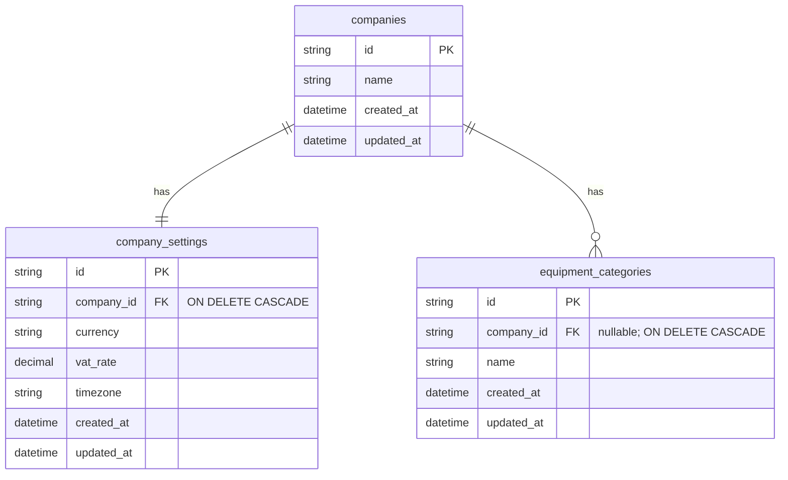

# Database

```mermaid
erDiagram
  companies {
    string id PK
    string name
    datetime created_at
    datetime updated_at
  }

  company_settings {
    string id PK
    string company_id FK "ON DELETE CASCADE"
    string currency
    decimal vat_rate
    string timezone
    datetime created_at
    datetime updated_at
  }

  equipment_categories {
    string id PK
    string company_id FK "nullable; ON DELETE CASCADE"
    string name
    datetime created_at
    datetime updated_at
  }

  companies ||--|| company_settings : "has"
  companies ||--o{ equipment_categories : "has"
```