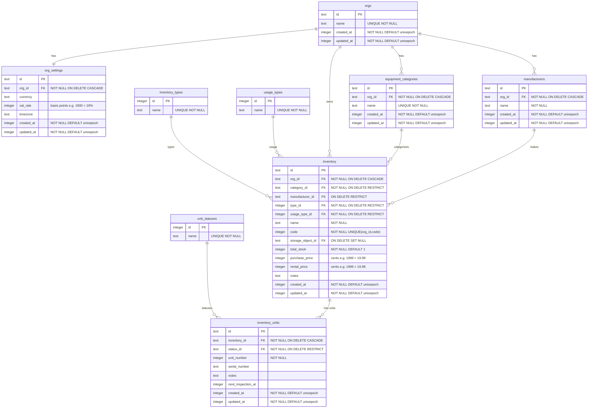

# Database

```mermaid
erDiagram
  orgs {
    text id PK
    text name "UNIQUE NOT NULL"
    integer created_at "NOT NULL DEFAULT unixepoch"
    integer updated_at "NOT NULL DEFAULT unixepoch"
  }

  org_settings {
    text id PK
    text org_id FK "NOT NULL ON DELETE CASCADE"
    text currency
    integer vat_rate "basis points e.g. 1900 = 19%"
    text timezone
    integer created_at "NOT NULL DEFAULT unixepoch"
    integer updated_at "NOT NULL DEFAULT unixepoch"
  }

  equipment_categories {
    text id PK
    text org_id FK "NOT NULL ON DELETE CASCADE"
    text name "UNIQUE NOT NULL"
    integer created_at "NOT NULL DEFAULT unixepoch"
    integer updated_at "NOT NULL DEFAULT unixepoch"
  }

  manufacturers {
    text id PK
    text org_id FK "NOT NULL ON DELETE CASCADE"
    text name "NOT NULL"
    integer created_at "NOT NULL DEFAULT unixepoch"
    integer updated_at "NOT NULL DEFAULT unixepoch"
  }
  %% name must be unique per org: UNIQUE(org_id, name)

  inventory_types {
    integer id PK
    text name "UNIQUE NOT NULL"
  }
  %% seeded with bulk and serialized; extend by inserting new rows

  usage_types {
    integer id PK
    text name "UNIQUE NOT NULL"
  }
  %% seeded with rental and sale; extend by inserting new rows

  inventory {
    text id PK
    text org_id FK "NOT NULL ON DELETE CASCADE"
    text category_id FK "NOT NULL ON DELETE RESTRICT"
    text manufacturer_id FK "ON DELETE RESTRICT"
    integer type_id FK "NOT NULL ON DELETE RESTRICT"
    integer usage_type_id FK "NOT NULL ON DELETE RESTRICT"
    text name "NOT NULL"
    integer code "NOT NULL UNIQUE(org_id,code)"
    text storage_object_id FK "ON DELETE SET NULL"
    integer total_stock "NOT NULL DEFAULT 1"
    integer purchase_price "cents e.g. 1999 = 19.99"
    integer rental_price "cents e.g. 1999 = 19.99"
    text notes
    integer created_at "NOT NULL DEFAULT unixepoch"
    integer updated_at "NOT NULL DEFAULT unixepoch"
  }
  %% code is auto-assigned at creation (MAX(code)+1 per org); user-editable but must remain a positive integer unique within the org
  %% prices are stored exclusive of VAT (net); VAT is applied at invoice time using org_settings.vat_rate

  unit_statuses {
    integer id PK
    text name "UNIQUE NOT NULL"
  }
  %% seeded with available, damaged, under_repair, retired

  inventory_units {
    text id PK
    text inventory_id FK "NOT NULL ON DELETE CASCADE"
    text status_id FK "NOT NULL ON DELETE RESTRICT"
    integer unit_number "NOT NULL"
    text serial_number
    text notes
    integer next_inspection_at
    integer created_at "NOT NULL DEFAULT unixepoch"
    integer updated_at "NOT NULL DEFAULT unixepoch"
  }
  %% unit_number must be unique per inventory item: UNIQUE(inventory_id, unit_number)
  %% unit_number is auto-assigned by the application (next available integer per inventory item); serial_number is optional

  inventory_types ||--o{ inventory : "types"
  usage_types ||--o{ inventory : "usage"
  unit_statuses ||--o{ inventory_units : "statuses"
  orgs ||--|| org_settings : "has"
  orgs ||--o{ equipment_categories : "has"
  orgs ||--o{ manufacturers : "has"
  orgs ||--o{ inventory : "owns"
  equipment_categories ||--o{ inventory : "categorizes"
  manufacturers ||--o{ inventory : "makes"
  inventory ||--o{ inventory_units : "has units"
```
