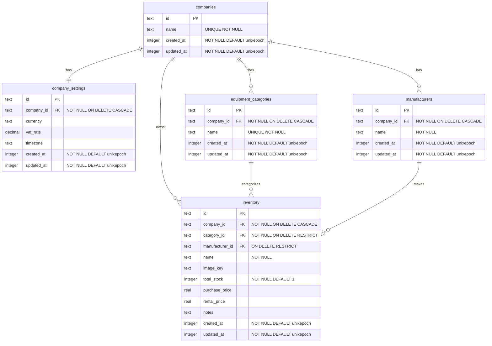

# Database

```mermaid
erDiagram
  companies {
    text id PK
    text name "UNIQUE NOT NULL"
    integer created_at "NOT NULL DEFAULT unixepoch"
    integer updated_at "NOT NULL DEFAULT unixepoch"
  }

  company_settings {
    text id PK
    text company_id FK "NOT NULL ON DELETE CASCADE"
    text currency
    decimal vat_rate
    text timezone
    integer created_at "NOT NULL DEFAULT unixepoch"
    integer updated_at "NOT NULL DEFAULT unixepoch"
  }

  equipment_categories {
    text id PK
    text company_id FK "NOT NULL ON DELETE CASCADE"
    text name "UNIQUE NOT NULL"
    integer created_at "NOT NULL DEFAULT unixepoch"
    integer updated_at "NOT NULL DEFAULT unixepoch"
  }

  manufacturers {
    text id PK
    text company_id FK "NOT NULL ON DELETE CASCADE"
    text name "NOT NULL"
    integer created_at "NOT NULL DEFAULT unixepoch"
    integer updated_at "NOT NULL DEFAULT unixepoch"
  }
  %% name must be unique per company: UNIQUE(company_id, name)

  inventory {
    text id PK
    text company_id FK "NOT NULL ON DELETE CASCADE"
    text category_id FK "NOT NULL ON DELETE RESTRICT"
    text manufacturer_id FK "ON DELETE RESTRICT"
    text name "NOT NULL"
    text image_key
    integer total_stock "NOT NULL DEFAULT 1"
    real purchase_price
    real rental_price
    text notes
    integer created_at "NOT NULL DEFAULT unixepoch"
    integer updated_at "NOT NULL DEFAULT unixepoch"
  }

  companies ||--|| company_settings : "has"
  companies ||--o{ equipment_categories : "has"
  companies ||--o{ manufacturers : "has"
  companies ||--o{ inventory : "owns"
  equipment_categories ||--o{ inventory : "categorizes"
  manufacturers ||--o{ inventory : "makes"
```
