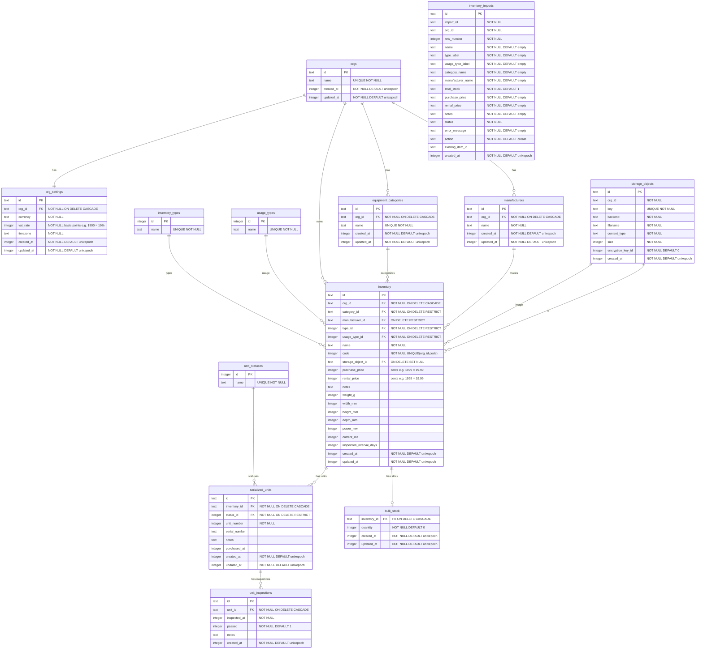

# Database

```mermaid
erDiagram
  orgs {
    text id PK
    text name "UNIQUE NOT NULL"
    integer created_at "NOT NULL DEFAULT unixepoch"
    integer updated_at "NOT NULL DEFAULT unixepoch"
  }

  org_settings {
    text id PK
    text org_id FK "NOT NULL ON DELETE CASCADE"
    text currency "NOT NULL"
    integer vat_rate "NOT NULL basis points e.g. 1900 = 19%"
    text timezone "NOT NULL"
    integer created_at "NOT NULL DEFAULT unixepoch"
    integer updated_at "NOT NULL DEFAULT unixepoch"
  }

  equipment_categories {
    text id PK
    text org_id FK "NOT NULL ON DELETE CASCADE"
    text name "UNIQUE NOT NULL"
    integer created_at "NOT NULL DEFAULT unixepoch"
    integer updated_at "NOT NULL DEFAULT unixepoch"
  }

  manufacturers {
    text id PK
    text org_id FK "NOT NULL ON DELETE CASCADE"
    text name "NOT NULL"
    integer created_at "NOT NULL DEFAULT unixepoch"
    integer updated_at "NOT NULL DEFAULT unixepoch"
  }
  %% name must be unique per org: UNIQUE(org_id, name)

  inventory_types {
    integer id PK
    text name "UNIQUE NOT NULL"
  }
  %% seeded with bulk and serialized; extend by inserting new rows

  usage_types {
    integer id PK
    text name "UNIQUE NOT NULL"
  }
  %% seeded with rental and sale; extend by inserting new rows

  storage_objects {
    text id PK
    text org_id "NOT NULL"
    text key "UNIQUE NOT NULL"
    text backend "NOT NULL"
    text filename "NOT NULL"
    text content_type "NOT NULL"
    integer size "NOT NULL"
    integer encryption_key_id "NOT NULL DEFAULT 0"
    integer created_at "NOT NULL DEFAULT unixepoch"
  }

  inventory {
    text id PK
    text org_id FK "NOT NULL ON DELETE CASCADE"
    text category_id FK "NOT NULL ON DELETE RESTRICT"
    text manufacturer_id FK "ON DELETE RESTRICT"
    integer type_id FK "NOT NULL ON DELETE RESTRICT"
    integer usage_type_id FK "NOT NULL ON DELETE RESTRICT"
    text name "NOT NULL"
    integer code "NOT NULL UNIQUE(org_id,code)"
    text storage_object_id FK "ON DELETE SET NULL"
    integer purchase_price "cents e.g. 1999 = 19.99"
    integer rental_price "cents e.g. 1999 = 19.99"
    text notes
    integer weight_g
    integer width_mm
    integer height_mm
    integer depth_mm
    integer power_mw
    integer current_ma
    integer inspection_interval_days
    integer created_at "NOT NULL DEFAULT unixepoch"
    integer updated_at "NOT NULL DEFAULT unixepoch"
  }
  %% code is auto-assigned at creation (MAX(code)+1 per org); user-editable but must remain a positive integer unique within the org
  %% prices are stored exclusive of VAT (net); VAT is applied at invoice time using org_settings.vat_rate

  unit_statuses {
    integer id PK
    text name "UNIQUE NOT NULL"
  }
  %% seeded with available, damaged, under_repair, retired

  serialized_units {
    text id PK
    text inventory_id FK "NOT NULL ON DELETE CASCADE"
    integer status_id FK "NOT NULL ON DELETE RESTRICT"
    integer unit_number "NOT NULL"
    text serial_number
    text notes
    integer purchased_at
    integer created_at "NOT NULL DEFAULT unixepoch"
    integer updated_at "NOT NULL DEFAULT unixepoch"
  }
  %% unit_number must be unique per inventory item: UNIQUE(inventory_id, unit_number)
  %% unit_number is auto-assigned by the application (next available integer per inventory item); serial_number is optional

  bulk_stock {
    text inventory_id PK "FK ON DELETE CASCADE"
    integer quantity "NOT NULL DEFAULT 0"
    integer created_at "NOT NULL DEFAULT unixepoch"
    integer updated_at "NOT NULL DEFAULT unixepoch"
  }

  inventory_imports {
    text id PK
    text import_id "NOT NULL"
    text org_id "NOT NULL"
    integer row_number "NOT NULL"
    text name "NOT NULL DEFAULT empty"
    text type_label "NOT NULL DEFAULT empty"
    text usage_type_label "NOT NULL DEFAULT empty"
    text category_name "NOT NULL DEFAULT empty"
    text manufacturer_name "NOT NULL DEFAULT empty"
    text total_stock "NOT NULL DEFAULT 1"
    text purchase_price "NOT NULL DEFAULT empty"
    text rental_price "NOT NULL DEFAULT empty"
    text notes "NOT NULL DEFAULT empty"
    text status "NOT NULL"
    text error_message "NOT NULL DEFAULT empty"
    text action "NOT NULL DEFAULT create"
    text existing_item_id
    integer created_at "NOT NULL DEFAULT unixepoch"
  }

  unit_inspections {
    text id PK
    text unit_id FK "NOT NULL ON DELETE CASCADE"
    integer inspected_at "NOT NULL"
    integer passed "NOT NULL DEFAULT 1"
    text notes
    integer created_at "NOT NULL DEFAULT unixepoch"
  }

  inventory_types ||--o{ inventory : "types"
  usage_types ||--o{ inventory : "usage"
  unit_statuses ||--o{ serialized_units : "statuses"
  orgs ||--|| org_settings : "has"
  orgs ||--o{ equipment_categories : "has"
  orgs ||--o{ manufacturers : "has"
  orgs ||--o{ inventory : "owns"
  equipment_categories ||--o{ inventory : "categorizes"
  manufacturers ||--o{ inventory : "makes"
  inventory ||--o{ serialized_units : "has units"
  serialized_units ||--o{ unit_inspections : "has inspections"
  inventory ||--o| bulk_stock : "has stock"
  storage_objects ||--o{ inventory : "image"
  storage_objects ||--o{ inventory : "qr"
```
