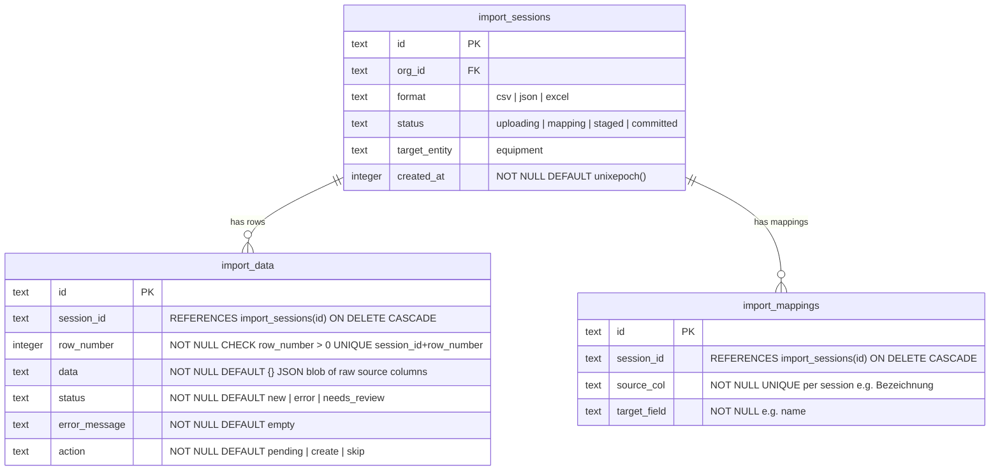

# Database: Format agnostic import process

The goal is to let the user bring any format (start with csv), upload it, map it to Gearberg internal, and import it into the system.

This requires a bigger refactor, but we are in alpha, so we can completly delete the current design and make this possible.

We will gain easy of use and better adoption by designing a better import process.

The flow consists of following steps:

1. Upload CSV
2. Create import session
3. Populate `import_data` with raw rows
4. User maps source columns to Gearberg fields (`import_mappings`)
5. System validates and applies mappings, runs validation steps, marks rows
6. User reviews and resolves decision
7. User confirms and commit to inventory/equipment

We don't support editing in the UI yet, but we can do this easily by adding an override field to the import data table.

This flow can be put simply into:

1. Stage (NewSession)
2. Review
3. Commit

to abstract the complex logic behind a simple interface.

